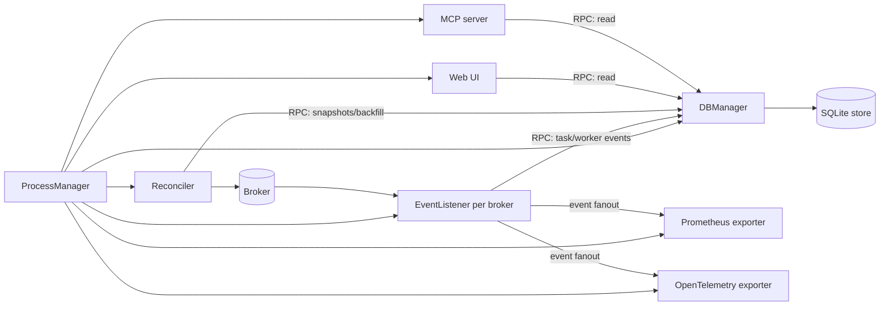

## Process model

The supervisor process starts and monitors these components:

- **DB manager**: hosts the RPC server, writes to the SQLite store, and manages migrations.
- **Event listener** (per broker): subscribes to Celery events and forwards task/worker events to the DB manager. It also fans out events to metrics exporters.
- **Reconciler**: polls brokers and workers to backfill task states and queue/worker snapshots.
- **Web UI**: Django-based UI server.
- **Metrics exporters**: Prometheus and/or OpenTelemetry (optional).
- **MCP server**: read-only data access for MCP clients (optional).

## Event flow

- Workers emit events to the broker.
- Event listeners consume events and send them to the DB manager via RPC. They also fan out events to metrics exporters.
- Reconciler polls brokers and workers and writes snapshots and backfilled task updates through the DB manager.
- The DB manager writes to storage.
- The UI and MCP server read through the DB manager RPC API to render dashboards, task lists, and graphs.

## Storage

SQLite is the default. The DB manager is the only process that touches the database. It handles schema migrations and periodic cleanup based on the configured retention window, and exposes an RPC API for reads and writes.
