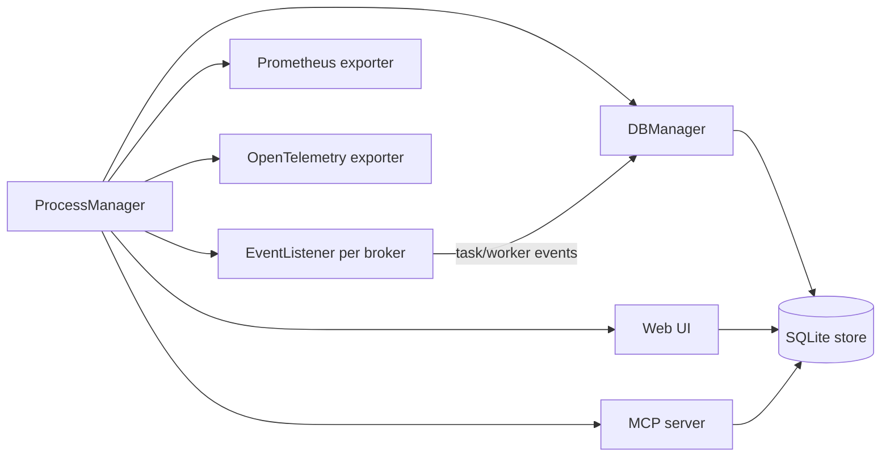

## Process model

The supervisor process starts and monitors these components:

- **DB manager**: reads events from queues, writes to the SQLite store, and manages migrations.
- **Event listener** (per broker): subscribes to Celery events and forwards task/worker events.
- **Web UI**: Django-based UI server.
- **Metrics exporters**: Prometheus and/or OpenTelemetry (optional).
- **MCP server**: read-only data access for MCP clients (optional).

## Event flow

- Workers emit events to the broker.
- Event listeners consume events and push them into a multiprocessing queue.
- DB manager batches events and writes them to storage.
- The UI reads from the same store to render dashboards, task lists, and graphs.

## Storage

SQLite is the default. The DB controller handles schema migrations and periodic cleanup based on the configured retention window.

## Documentation index

> Fetch the complete documentation index at: https://www.mintlify.com/docs/llms.txt
> Use this file to discover all available pages before exploring further.
